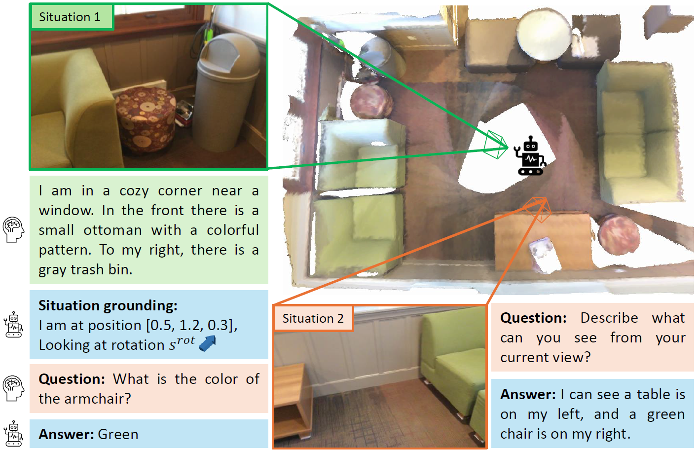

# [CVPR 2025] Empowering Large Language Models with 3D Situation Awareness

 [](https://arxiv.org/abs/2503.23024) 

 ## Overview

<div align="center">
  
</div>

Driven by the great success of Large Language Models (LLMs) in the 2D image domain, their application in 3D scene understanding has emerged as a new trend. A key difference between 3D and 2D is that the situation of an egocentric observer in 3D scenes can change, resulting in different descriptions (e.g., "left" or `"right"). However, current LLM-based methods overlook the egocentric perspective and  use datasets from a global viewpoint. To address this issue, we propose a novel approach to automatically generate a situation-aware dataset by leveraging the scanning trajectory during data collection and utilizing Vision-Language Models (VLMs) to produce high-quality captions and question-answer pairs. Furthermore, we introduce a situation grounding module to explicitly predict the position and orientation of the observer's viewpoint, thereby enabling LLMs to ground situation descriptions in 3D scenes. We evaluate our approach on several benchmarks, demonstrating that our method effectively enhances the 3D situational awareness of LLMs while significantly expanding existing datasets and reducing manual effort.


## 🔨 Preparation

- We update our codebase to [Chat-Scene](https://github.com/ZzZZCHS/Chat-Scene).

- Prepare the environment:
  
  ```shell
  conda create -n chat-scene python=3.9.17
  conda activate chat-scene
  conda install pytorch==2.2.1 torchvision==0.17.1 torchaudio==2.2.1 pytorch-cuda=11.8 -c pytorch -c nvidia
  pip install -r requirements.txt
  ```
  
- Download LLM backbone:
  -  We use Vicuna-7B v1.5 in our experiments, which can be downloaded from [Hugging Face](https://huggingface.co/lmsys/vicuna-7b-v1.5).

  - Change the `llama_model_path` in [run.sh](./scripts/run.sh) to the path of `vicuna-7b-v1.5`.
  
- Download Our View2Cap dataset from [OneDrive](https://cuhko365-my.sharepoint.com/:f:/g/personal/221019046_link_cuhk_edu_cn/En2Q-D6RkbpFkkVDUZfm-1cBW0gX16O6fRC_CP33_TGy8A?e=jhv1il)

- Annotations and extracted features:
  
  Please follow the instructions in [preprocess](preprocess/).


## 🤖 Training and Inference

- Pre-training with view2cap dataset
  - Modify [train.sh](scripts/train_view2cap.sh):
  - Run: `bash scripts/train_view2cap.sh`

- Fine-tuning on downstream tasks
  - Modify [train_view2cap.sh](scripts/train_view2cap.sh):
  - Run: `bash scripts/train_view2cap.sh`

- Inference
  
  - Modify [eval.sh](scripts/eval.sh):
  
    ```python
    val_tag="scanrefer#scan2cap#scanqa#sqa3d#multi3dref"
    evaluate=True
    pretrained_path="/path/to/pretrained_model.pth"
    ```
  
  - Run: `bash scripts/eval.sh`
  

## 📄 Citation

If you find this project useful in your research, please consider cite:
```BibTeX
@InProceedings{Yuan_2025_CVPR,
    author    = {Yuan, Zhihao and Peng, Yibo and Ren, Jinke and Liao, Yinghong and Han, Yatong and Feng, Chun-Mei and Zhao, Hengshuang and Li, Guanbin and Cui, Shuguang and Li, Zhen},
    title     = {Empowering Large Language Models with 3D Situation Awareness},
    booktitle = {Proceedings of the Computer Vision and Pattern Recognition Conference (CVPR)},
    month     = {June},
    year      = {2025},
    pages     = {19435-19445}
}
```

Stay tuned for our project. 🔥

## 😊 Acknowledgement

Thanks to the open source of the following projects:

(Multi-modal) LLMs:
[LLaMA](https://github.com/facebookresearch/llama), 
[Vicuna](https://github.com/lm-sys/FastChat),
[VideoChat](https://github.com/OpenGVLab/Ask-Anything/tree/main/video_chat), 
[LEO](https://github.com/embodied-generalist/embodied-generalist)

3D Datasets:
[ScanNet](https://github.com/ScanNet/ScanNet), 
[ScanRefer](https://github.com/daveredrum/ScanRefer), 
[ReferIt3D](https://github.com/referit3d/referit3d), 
[Scan2Cap](https://github.com/daveredrum/Scan2Cap), 
[ScanQA](https://github.com/ATR-DBI/ScanQA), 
[SQA3D](https://github.com/SilongYong/SQA3D), 
[Multi3dRefer](https://github.com/3dlg-hcvc/M3DRef-CLIP)

Detectors:
[PointGroup](https://github.com/dvlab-research/PointGroup), 
[Mask3D](https://github.com/JonasSchult/Mask3D),
[DEVA](https://github.com/hkchengrex/Tracking-Anything-with-DEVA)

Representations:
[ULIP](https://github.com/salesforce/ULIP), 
[Uni3D](https://github.com/baaivision/Uni3D),
[DINOv2](https://github.com/facebookresearch/dinov2)

3D Models:
[vil3dref](https://github.com/cshizhe/vil3dref),
[OpenScene](https://github.com/pengsongyou/openscene)

